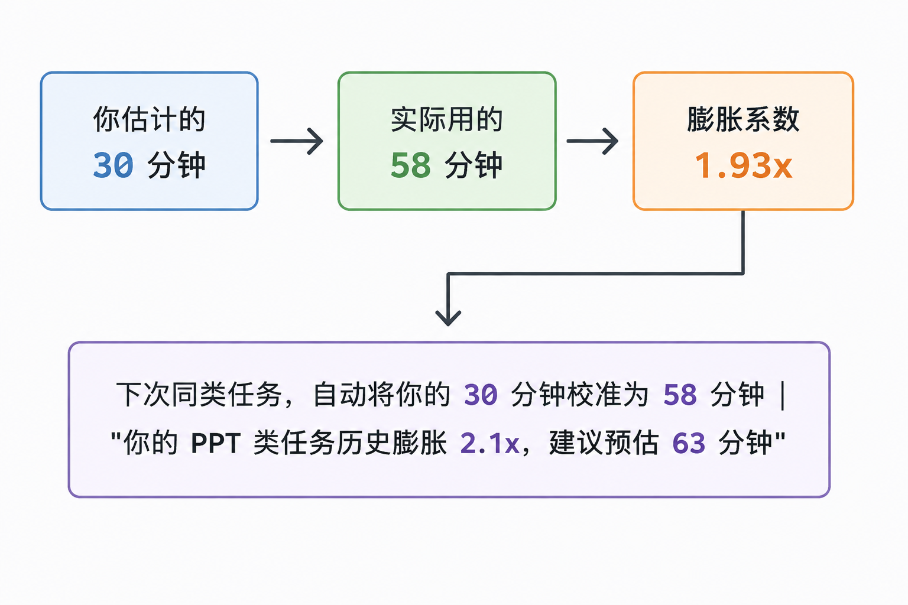
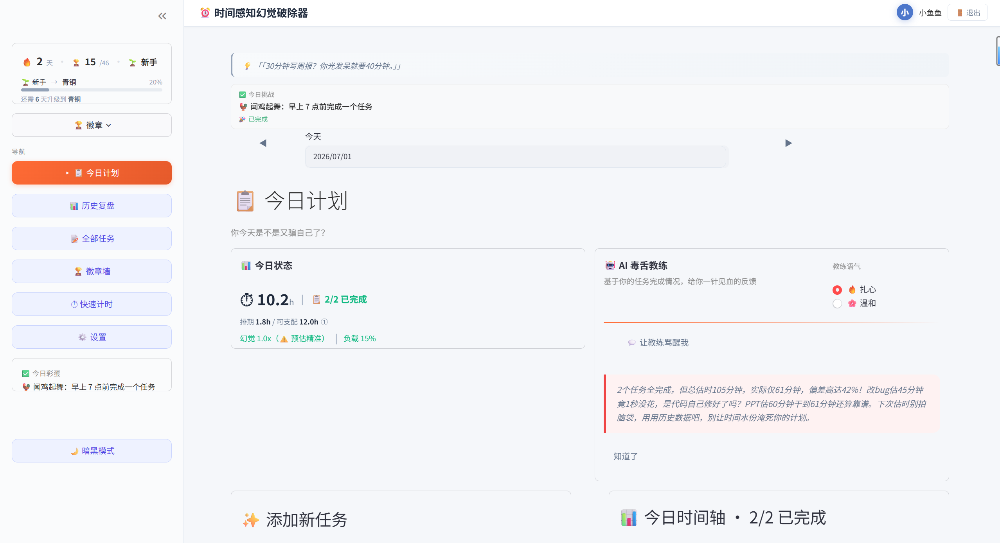
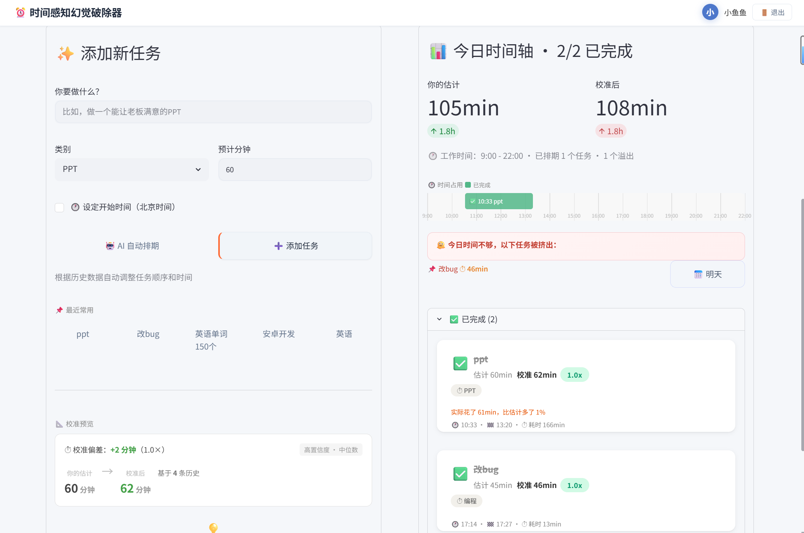
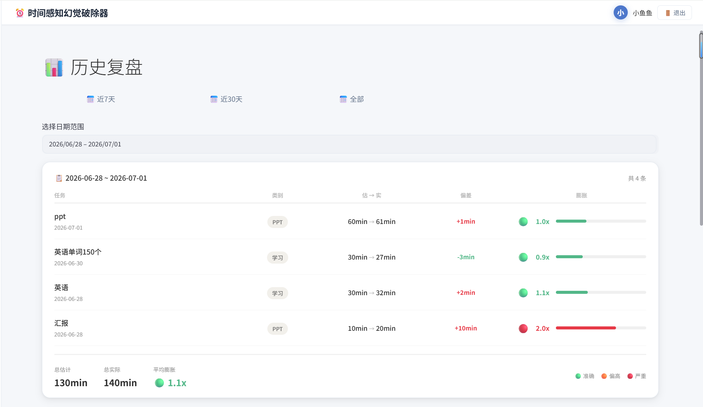
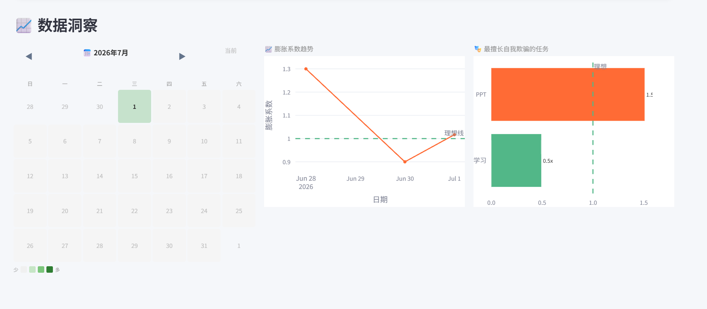
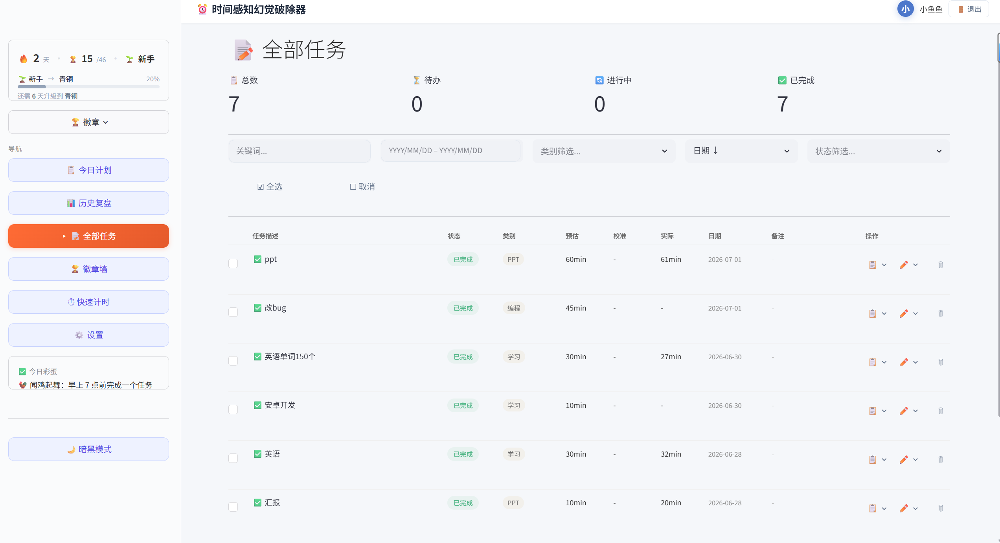
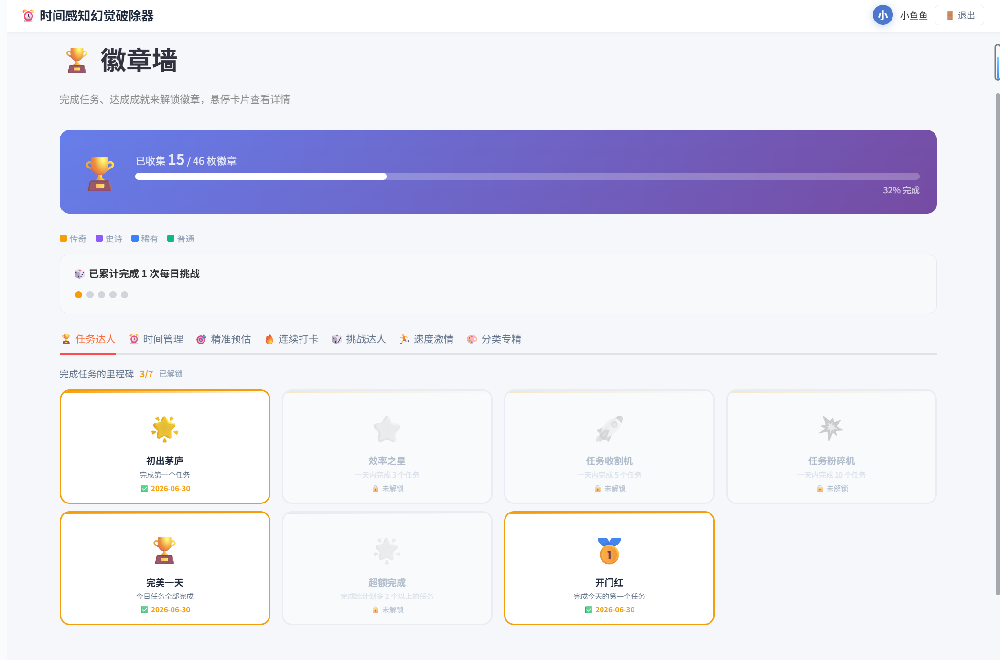
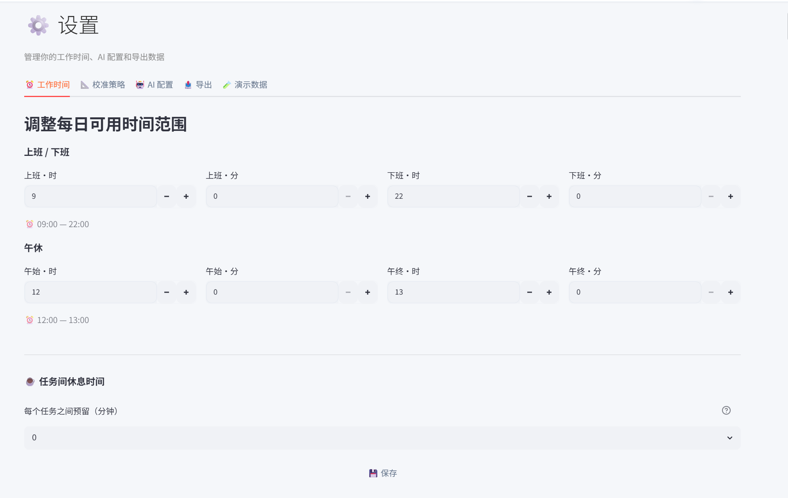
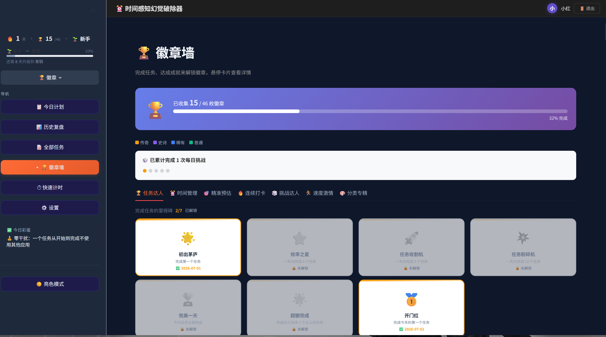

# ⏰ 时间感知幻觉破除器

> **你以为 30 分钟能写完周报？数据说你需要 58 分钟。醒醒吧。**

一个用冰冷数据戳破你时间幻觉的 Streamlit 应用。它记录你每次对任务耗时的估计和实际完成情况，用统计学无情地揭穿你的"我觉得很快"，并用 AI 毒舌教练督促你面对现实。

---

## 📋 目录

- 🏠 **[项目概览](#项目概览)**
  - [设计理念](#设计理念) · [项目简介](#项目简介) · [界面截图](#界面截图) · [功能概览](#功能概览) · [用户体验](#用户体验) · [技术栈](#技术栈)

- 🏗️ **[架构与设计](#架构与设计)**
  - [架构设计](#架构设计) · [项目结构](#项目结构) · [数据库结构](#数据库结构) · [核心机制详解](#核心机制详解) · [数据安全与隐私](#数据安全与隐私)

- 🚀 **[快速开始](#快速开始)**
  - [快速开始](#快速开始) · [Docker 部署](#docker-部署) · [生产环境配置](#生产环境配置) · [环境变量说明](#环境变量说明)

- 📖 **[功能指南](#功能指南)**
  - [完整使用流程](#完整使用流程) · [成就系统全览](#成就系统全览) · [每日挑战全览](#每日挑战全览)

- 🌐 **[API 参考](#api-参考)**
  - [REST API](#rest-api) · [API 调用示例](#api-调用示例)

- ⚙️ **[运维与扩展](#运维与扩展)**
  - [常见问题](#常见问题) · [性能与扩展性](#性能与扩展性) · [未来规划](#未来规划)

- 🤝 **[贡献](#贡献)**
  - [贡献指南](#贡献指南) · [许可证](#许可证)

---


## 项目概览

### 设计理念

### 什么是"时间幻觉"？

心理学上称之为**计划谬误（Planning Fallacy）**——人类在估算任务耗时的时候，系统性地倾向于低估所需时间。这不是能力问题，而是进化留给我们的认知偏差。

### 这个应用如何解决？



### 四大支柱

| 支柱 | 说明 | 代表功能 |
|------|------|---------|
| 📝 **记录** | 每次任务都记录预估 vs 实际 | 任务创建、计时器、实测耗时录入 |
| 📐 **校准** | 按类别统计膨胀系数，自动修正 | 4 种校准策略、校准预览、数据分层 |
| 💬 **反馈** | 数据驱动的毒舌/温和点评 | AI 毒舌教练、复盘表格、幻觉标签 |
| 🎮 **游戏化** | 让坚持本身变得有趣 | 46 成就、50 挑战、5 级段位、Toast 通知 |

---

## 项目简介

### 这个应用做什么？

**时间感知幻觉破除器** 是一个任务管理与时间校准工具，核心目标是：**用数据纠正你对时间的主观偏差**。

大多数人在估算任务耗时的时候，都会陷入"计划谬误"——系统性地低估任务所需时间。你以为写 PPT 要 30 分钟，实际花了 78 分钟；你以为开会只要 1 小时，结果拖了 2 个半小时。

这个应用通过以下方式帮你打破幻觉：

1. **记录**：每次创建任务时输入预估时间，完成后记录实际耗时
2. **校准**：系统按类别（PPT、写作、会议…）统计你的历史膨胀系数，下次自动修正你的预估
3. **反馈**：AI 毒舌教练用数据说话，告诉你"今天的你又膨胀了 2.3 倍"
4. **游戏化**：46 个成就徽章、50 个每日彩蛋挑战、连续打卡等级系统，让坚持变得有动力

### 核心亮点

| 亮点 | 说明 |
|------|------|
| 🧠 **AI 智能预估** | 分析历史数据 + LLM 推理，给出精准的预估时间 |
| 📐 **校准引擎** | 4 种策略（中位数/均值/加权/线性回归），按类别统计膨胀系数 |
| 💬 **AI 毒舌教练** | 支持 OpenAI / DeepSeek / 通义千问，扎心 & 温和 两种语气 |
| 🏆 **成就系统** | 46 个成就徽章，7 个类别，覆盖任务量、时间管理、精准预估等 |
| 🔥 **连续打卡** | 5 级段位（🌱新手→🥉青铜→🥈白银→🥇黄金→💎钻石） |
| 🎲 **每日挑战** | 50 个彩蛋挑战，每天随机抽取，完成获得专属徽章 |
| ⏱️ **实时计时器** | 浮动计时器，精确到秒，超时变红闪烁 |
| 📊 **数据复盘** | 日历热力图、膨胀系数趋势图、分类统计图 |
| 🔐 **多用户隔离** | 完整的登录/注册系统，bcrypt 密码加密，Cookie 记住登录 |
| 🌐 **REST API** | FastAPI 接口，16 个端点，可对接外部系统 |
| 🌓 **暗色模式** | 跟随系统自动切换，所有组件适配暗色主题 |
| 📤 **数据导出** | 支持 CSV 和 JSON 格式导出全部任务数据 |

---

## 界面截图

> 💡 **截图提示**：以下截图需要手动添加到仓库中。建议在 `screenshots/` 目录下放置实际截图，并更新下方链接。高质量截图对于开源项目吸引用户和贡献者至关重要。

| 页面 | 截图 |
|------|------|
| 今日计划 |   |
| 历史复盘 |   |
| 全部任务 |  |
| 徽章墙 |  |
| 设置 |  |
| 暗色模式 |  |

推荐的截图尺寸：**1280×800** 以上，PNG 格式，展示完整页面（含侧边栏和顶栏）。

---

## 功能概览

### 今日计划（核心页面）

- **任务创建**：描述、类别、预估时间、AI 智能预估、自定义开始时间、校准预览
- **任务状态管理**：待办 → 进行中 → 已完成，支持排序、编辑、删除
- **实时计时器**：浮动在页面顶部，精确到秒，超时变红闪烁
- **时间轴可视化**：任务在时间线上分布，自动排期，溢出警告
- **每日一句**：每日随机毒舌/鸡汤语录
- **每日彩蛋挑战**：随机抽取趣味挑战，完成获得专属徽章
- **AI 毒舌教练**：根据完成情况生成个性化点评，支持扎心/温和两种语气
- **最近常用**：一键复用历史任务模板，点击弹出确认卡片

### 历史复盘

- **日历热力图**：按月份展示每日任务完成情况，颜色深浅表示完成数量
- **膨胀系数趋势图**：折线图展示历史膨胀系数变化，1.0x 理想线对比
- **分类统计图**：柱状图展示各分类的膨胀系数，一眼看出最擅长自我欺骗的类别
- **复盘表格**：预估 vs 实际 vs 偏差对比，绿色靠谱、红色翻车

### 全部任务

- 查看所有历史任务，支持分页和搜索
- 按状态、类别、日期筛选
- 行内编辑、查看详情
- **模态对话框删除确认**，防止误删
- 批量选择和批量操作

### 徽章墙

- 46 个成就徽章，分布在 7 个类别中（详见[成就系统全览](#成就系统全览)）
- 已解锁/未解锁状态可视化，进度追踪
- 分类标签页，点击切换查看

### 快速计时

- 不创建任务直接计时
- 事后补录描述和类别
- 自动保存到今日任务列表

### 设置（5 个标签页）

| 标签页 | 内容 |
|--------|------|
| ⏰ 工作时间 | 上班/下班时间、午休时间、任务间休息时间 |
| 📐 校准 | 4 种策略可选、膨胀系数重置 |
| 🧪 演示数据 | 一键加载/清除 35 条模拟数据 |
| 🤖 AI 配置 | DeepSeek / 通义千问 / OpenAI 独立启用/禁用 |
| 📤 数据导出 | CSV 和 JSON 格式导出 |

### 用户系统

- 登录/注册（密码 bcrypt 加密存储）
- 记住我（Cookie 自动登录，3 天有效期）
- 多用户数据完全隔离
- 个人中心统计面板（总任务数、完成率、平均膨胀系数、连续打卡天数）

---

## 用户体验

### 键盘快捷键

| 快捷键 | 功能 |
|--------|------|
| `Ctrl + Enter` | 提交任务表单 |
| `Esc` | 关闭弹窗/对话框 |

### 移动端适配

当前版本主要针对桌面端（1280px+）设计。移动端适配已列入[未来规划](#未来规划)，计划以 PWA 形式提供，支持触屏手势操作和响应式布局。

### 多语言支持

当前界面语言为**简体中文**。国际化（i18n）支持已列入未来规划，计划支持英文、日文等语言。

### 通知机制

- **Toast 通知**：完成任务、解锁成就、获得徽章时弹出
- **计时器提醒**：超时后计时器变红闪烁，提醒你面对现实
- **每日挑战重置**：每天首次访问时自动刷新挑战

---

## 技术栈

| 层级 | 技术 | 版本 | 说明 |
|------|------|------|------|
| 前端框架 | Streamlit | ≥1.34.0 | Python 原生 Web 框架，无需 HTML/CSS/JS |
| 数据库 | SQLite | 内置 | 零配置、嵌入式关系数据库 |
| AI 集成 | OpenAI API | ≥1.0.0 | 兼容 DeepSeek / 通义千问 / OpenAI |
| REST API | FastAPI | ≥0.111.0 | 高性能异步 Web 框架 |
| 数据可视化 | Plotly | ≥5.18.0 | 交互式图表（热力图、折线图、柱状图） |
| 数据处理 | Pandas | ≥2.0.0 | 数据分析和导出 |
| 环境管理 | python-dotenv | ≥1.0.0 | 环境变量加载 |
| 测试 | pytest | ≥8.0.0 | 单元测试框架 |

### 主要依赖

```
# 核心
streamlit>=1.34.0
pandas>=2.0.0
plotly>=5.18.0

# AI
openai>=1.0.0

# 环境
python-dotenv>=1.0.0

# API（可选）
fastapi>=0.111.0
uvicorn>=0.29.0

# 测试
pytest>=8.0.0
```

---

## 架构与设计

## 架构设计

### 分层架构

```
┌─────────────────────────────────────────────────┐
│                    UI 层 (ui/)                    │
│  sidebar.py  topbar.py  task_creation.py          │
│  timeline.py  timer.py  review.py                 │
│  badges.py  settings.py  login.py  profile.py     │
├─────────────────────────────────────────────────┤
│                  业务逻辑层 (services/)            │
│  calibration.py  task_manager.py  achievements.py │
│  ai_estimator.py  roast_generator.py  auth.py    │
│  streak.py  challenge.py  calendar_service.py    │
├─────────────────────────────────────────────────┤
│                  数据访问层 (dao/)                 │
│  task_dao.py  settings_dao.py  user_dao.py       │
│  streak_dao.py  calendar_dao.py                  │
├─────────────────────────────────────────────────┤
│                  工具层 (utils/)                   │
│  config.py  db.py  helpers.py  security.py       │
│  cookies.py                                       │
└─────────────────────────────────────────────────┘
```

### 数据流

```
用户操作 → UI 组件 → 业务逻辑 (services/)
                        ↓
                  DAO 层 (SQL 操作)
                        ↓
                  SQLite 数据库
                        ↓
                  返回结果 → UI 更新
```

### AI 降级链

```
用户请求 AI 功能
    │
    ├── DeepSeek API 可用? ──→ 使用 DeepSeek
    │   ├── 失败
    ├── 通义千问 API 可用? ──→ 使用通义千问
    │   ├── 失败
    ├── OpenAI API 可用? ──→ 使用 OpenAI
    │   ├── 失败
    └── 使用内置规则模板
```

### 页面路由

```
app.py main()
    │
    ├── 未登录 → render_login_page()
    │
    ├── 已登录:
    │   ├── 侧栏导航 (sidebar.py)
    │   │   ├── "今日计划" → render_today_page()
    │   │   ├── "历史复盘" → render_history_review()
    │   │   ├── "全部任务" → render_all_tasks_page()
    │   │   ├── "徽章墙" → render_badges_page()
    │   │   ├── "快速计时" → render_quick_timer_page()
    │   │   └── "设置" → render_settings_page()
    │   └── 顶栏 (topbar.py) + 浮动计时器 (timer.py)
    └── 退出登录 → handle_logout()
```

---

## 快速开始

### 环境要求

| 依赖 | 版本 | 备注 |
|------|------|------|
| Python | 3.10+ | 3.9 以下不保证兼容 |
| pip | 最新版 | `pip install --upgrade pip` |
| 磁盘空间 | ≥ 500MB | 含虚拟环境和依赖 |

### 安装

```bash
# 1. 克隆项目
git clone <your-repo-url>
cd ai_program

# 2. 创建虚拟环境（强烈推荐）
python -m venv .venv

# 3. 激活虚拟环境
# Windows:
.venv\Scripts\activate
# macOS / Linux:
# source .venv/bin/activate

# 4. 安装依赖
pip install -r requirements.txt
```

### 配置 AI（可选）

编辑项目根目录下的 `.env` 文件（参考 `.env.example`），填入任意一个 AI 提供商的 API Key：

```env
# ─── 三选一即可，填哪个用哪个，全填更稳 ───

# ─── OpenAI ──────────────────────────
OPENAI_API_KEY=sk-xxxxxxxx
OPENAI_BASE_URL=                # 留空使用官方；代理/中转时填写
OPENAI_MODEL=gpt-3.5-turbo

# ─── 通义千问 (阿里云) ───────────────
QWEN_API_KEY=sk-xxxxxxxx
QWEN_MODEL=qwen-plus

# ─── DeepSeek ────────────────────────
DEEPSEEK_API_KEY=sk-xxxxxxxx
DEEPSEEK_MODEL=deepseek-chat

# ─── API 接口（可选）──────────────────
API_TOKEN=change-me
API_CORS_ORIGINS=http://localhost:8501,http://127.0.0.1:8501
AI_TIMEOUT_SECONDS=20
```

> 💡 **不填任何 Key 也能正常使用所有功能**——AI 毒舌和 AI 智能预估会自动降级为内置规则。

### 启动

```bash
# 方式一：一键启动（推荐）
python start_web.py

# 方式二：直接启动 Streamlit
streamlit run app.py

# 方式三：同时启动 Streamlit + FastAPI
# 终端 1:
streamlit run app.py
# 终端 2:
uvicorn api:app --reload --port 8000
```

打开浏览器访问 **http://localhost:8501**。

> 首次启动会自动创建 SQLite 数据库文件 `data.db` 在项目根目录，无需额外配置。

---


## Docker 部署

### 快速启动

项目根目录提供了 `Dockerfile` 和 `docker-compose.yml`，可以一键启动 Streamlit + FastAPI 服务。

```bash
# 构建镜像
docker build -t time-illusion-breaker .

# 运行容器（使用环境变量）
docker run -p 8501:8501 -p 8000:8000 \
  -e DEEPSEEK_API_KEY=sk-xxx \
  -v $(pwd)/data:/app/data \
  time-illusion-breaker
```

### Docker Compose（推荐）

```bash
# 启动所有服务
docker-compose up -d

# 查看日志
docker-compose logs -f

# 停止服务
docker-compose down
```

### 环境变量覆盖

所有支持的环境变量都可以通过 `-e` 参数或 `docker-compose.yml` 中的 `environment` 字段覆盖，包括端口、数据库路径、AI 提供商密钥等。详见[环境变量说明](#环境变量说明)。

### 数据持久化

数据库文件 `data.db` 默认存储在容器内的 `/app/data/` 目录。启动时请挂载外部卷以防止数据丢失：

```bash
-v $(pwd)/data:/app/data
```

---

## 生产环境配置

### 端口修改

默认端口可在启动时修改：

```bash
# Streamlit 使用 80 端口
streamlit run app.py --server.port 80

# FastAPI 使用 8080 端口
uvicorn api:app --host 0.0.0.0 --port 8080
```

### 使用 st.secrets 管理敏感信息

在 Streamlit Cloud 部署时，推荐使用 `st.secrets` 替代 `.env` 文件。在项目根目录创建 `.streamlit/secrets.toml`：

```toml
DEEPSEEK_API_KEY = "sk-xxx"
QWEN_API_KEY = "sk-xxx"
OPENAI_API_KEY = "sk-xxx"
API_TOKEN = "your-secure-token"
```

代码中通过 `st.secrets["DEEPSEEK_API_KEY"]` 读取，无需 `.env` 文件。

### 启用 HTTPS（反向代理）

推荐使用 Nginx 作为反向代理，配置 SSL 证书：

```nginx
server {
    listen 443 ssl;
    server_name your-domain.com;

    ssl_certificate     /etc/ssl/certs/your-cert.pem;
    ssl_certificate_key /etc/ssl/private/your-key.pem;

    location / {
        proxy_pass http://127.0.0.1:8501;
        proxy_http_version 1.1;
        proxy_set_header Upgrade $http_upgrade;
        proxy_set_header Connection "upgrade";
        proxy_set_header Host $host;
        proxy_set_header X-Forwarded-For $proxy_add_x_forwarded_for;
    }

    location /api/ {
        proxy_pass http://127.0.0.1:8000;
        proxy_set_header Host $host;
        proxy_set_header X-Forwarded-For $proxy_add_x_forwarded_for;
    }
}
```

### Streamlit 启动参数

生产环境建议添加以下参数：

```bash
streamlit run app.py \
  --server.headless true \
  --server.enableCORS false \
  --server.enableXsrfProtection true \
  --server.maxUploadSize 200 \
  --browser.gatherUsageStats false
```

| 参数 | 说明 |
|------|------|
| `--server.headless true` | 无头模式，不自动打开浏览器 |
| `--server.enableCORS false` | 关闭 CORS，由反向代理处理 |
| `--server.enableXsrfProtection true` | 启用跨站请求伪造保护 |
| `--server.maxUploadSize` | 限制上传文件大小（MB） |
| `--browser.gatherUsageStats false` | 关闭 Streamlit 使用统计 |

### 日志与监控

#### 日志文件

Streamlit 和 FastAPI 的日志默认输出到标准输出/标准错误。可在启动时重定向到文件：

```bash
# 带日志记录的启动
streamlit run app.py 2>&1 | tee -a logs/app.log &
uvicorn api:app --host 0.0.0.0 --port 8000 2>&1 | tee -a logs/api.log &
```

#### 健康检查端点

FastAPI 提供了 `/health` 端点用于容器编排的健康检查：

```bash
curl http://localhost:8000/health
# {"status": "ok"}
```

Docker / Kubernetes 健康检查配置示例：

```yaml
healthcheck:
  test: ["CMD", "curl", "-f", "http://localhost:8000/health"]
  interval: 30s
  timeout: 10s
  retries: 3
```

#### 日志级别

通过环境变量控制日志级别：

```bash
export LOG_LEVEL=DEBUG    # 调试模式，输出更多信息
export LOG_LEVEL=INFO     # 默认级别
export LOG_LEVEL=WARNING  # 仅输出警告和错误
```

---


## 环境变量说明

| 变量名 | 说明 | 示例 | 必需 |
|--------|------|------|------|
| `OPENAI_API_KEY` | OpenAI API 密钥 | `sk-xxx` | 否 |
| `OPENAI_BASE_URL` | OpenAI API 基础 URL（可选） | `https://api.openai.com/v1` | 否 |
| `OPENAI_MODEL` | OpenAI 模型名称 | `gpt-3.5-turbo` | 否 |
| `QWEN_API_KEY` | 通义千问 API 密钥 | `sk-xxx` | 否 |
| `QWEN_MODEL` | 通义千问模型名称 | `qwen-plus` | 否 |
| `DEEPSEEK_API_KEY` | DeepSeek API 密钥 | `sk-xxx` | 否 |
| `DEEPSEEK_MODEL` | DeepSeek 模型名称 | `deepseek-chat` | 否 |
| `AI_PROVIDER` | 默认 AI 提供商 | `deepseek` | 否 |
| `AI_TIMEOUT_SECONDS` | AI 请求超时秒数 | `20` | 否 |
| `API_TOKEN` | FastAPI 接口令牌 | `change-me` | 否 |
| `API_CORS_ORIGINS` | API CORS 允许的源 | `http://localhost:8501` | 否 |

---

## 项目结构

```
ai_program/
│
├── app.py                  # 🚪 Streamlit 主入口
│                           #    页面路由、任务卡片渲染、会话状态管理
│                           #    编辑/完成表单、动态副标题、打卡流程
│
├── api.py                  # 🌐 FastAPI REST 接口
│                           #    共享全部 Service + DAO，零代码重复
│
├── start_web.py            # 🚀 一键启动脚本
│
├── scheduler.py            # 📐 任务排程引擎
│                           #    校准后时间分配槽位、午休跳过
│                           #    支持自定义开始时间、任务间休息
│                           #    溢出检测与警告
│
├── requirements.txt        # 📦 Python 依赖清单
├── requirements-calendar.txt  # 📅 日历集成可选依赖
├── .env                    # 🔑 环境变量（API Key 配置）
├── .env.example            # 🔑 环境变量模板
├── .gitignore              # 🚫 Git 忽略规则
│
├── ui/                     # 🎨 UI 组件层
│   ├── sidebar.py          #    侧边栏：打卡信息卡片、导航、成就徽章弹窗
│   ├── topbar.py           #    顶部导航栏：应用名、用户头像、退出按钮
│   ├── task_creation.py    #    任务创建：AI 智能预估、校准预览、最近常用
│   ├── timeline.py         #    今日时间轴可视化
│   ├── timer.py            #    浮动计时器（页面顶部，精确到秒）
│   ├── review.py           #    全部任务、历史复盘、快速计时
│   ├── badges.py           #    徽章墙（分类展示、进度条）
│   ├── settings.py         #    设置（5 个标签页）
│   ├── login.py            #    登录/注册页面
│   └── profile.py          #    个人中心
│
├── services/               # ⚙️ 业务逻辑层
│   ├── calibration.py      #    校准引擎（4 种策略、数据分层）
│   ├── task_manager.py     #    任务 CRUD + 演示数据生成
│   ├── achievements.py     #    成就系统（46 个成就、条件判断、自动颁发）
│   ├── ai_estimator.py     #    AI 智能预估（历史数据分析 + LLM 调用）
│   ├── roast_generator.py  #    毒舌生成器（规则模板 + AI 多提供商降级）
│   ├── auth.py             #    用户认证（bcrypt 密码 + 记住登录）
│   ├── streak.py           #    连续打卡追踪（等级系统）
│   ├── challenge.py        #    每日挑战（50 个彩蛋挑战）
│   └── calendar_service.py #    日历集成服务
│
├── dao/                    # 🗄️ 数据访问层
│   ├── task_dao.py         #    任务表操作（增删改查、排序、批量）
│   ├── settings_dao.py     #    用户设置存取（Key-Value，多用户隔离）
│   ├── user_dao.py         #    用户表操作
│   ├── streak_dao.py       #    打卡记录操作
│   └── calendar_dao.py     #    日历数据操作
│
├── utils/                  # 🛠 工具层
│   ├── config.py           #    全局配置（类别、AI 提供商、CSS 样式）
│   ├── db.py               #    SQLite 初始化（建表、连接管理、迁移）
│   ├── helpers.py          #    辅助函数（头像生成、幻觉标签等）
│   ├── security.py         #    安全相关（密码哈希）
│   └── cookies.py          #    Cookie 管理
│
├── models/                 # 📦 数据模型
│   ├── task.py             #    任务数据模型
│   ├── achievement.py      #    成就/徽章数据模型
│   ├── user.py             #    用户数据模型
│   └── calendar_event.py   #    日历事件数据模型
│
├── data/                   # 📊 静态数据
│   └── daily_quotes.json   #    每日语录库
│
├── tests/                  # 🧪 测试
│   ├── test_db.py          #    数据库测试
│   ├── test_security.py    #    安全测试
│   └── test_user_isolation.py  # 多用户隔离测试
│
└── data.db                 # 🗄️ SQLite 数据库文件（自动生成）
```

---

## 数据库结构

### 表一览

| 表名 | 说明 | 关键字段 |
|------|------|----------|
| `users` | 用户表 | `id`, `password_hash`, `name`, `email`, `avatar`, `created_at` |
| `tasks` | 任务表 | `id`, `user_id`, `category`, `description`, `estimated_minutes`, `calibrated_minutes`, `actual_minutes`, `status`, `created_date`, `scheduled_start`, `notes` |
| `settings` | 用户设置表 | `key`, `user_id`, `value` (复合主键) |
| `streak_log` | 打卡记录表 | `id`, `user_id`, `task_date`, `done_count`, `created_at` |
| `calendar_events` | 日历事件表 | `id`, `user_id`, `source`, `title`, `start_time`, `end_time`, `is_busy` |
| `schema_migrations` | 迁移记录表 | `name`, `applied_at` |

### 详细结构

```sql
-- 用户表
CREATE TABLE users (
    id TEXT PRIMARY KEY,
    password_hash TEXT NOT NULL DEFAULT '',
    name TEXT NOT NULL DEFAULT '',
    email TEXT NOT NULL DEFAULT '',
    avatar TEXT NOT NULL DEFAULT '',
    created_at TIMESTAMP DEFAULT (datetime('now', 'localtime'))
);

-- 任务表
CREATE TABLE tasks (
    id INTEGER PRIMARY KEY AUTOINCREMENT,
    user_id TEXT NOT NULL DEFAULT 'default',
    category TEXT NOT NULL DEFAULT '',              -- PPT / 写作 / 会议 / 编程 / 设计 / 邮件 / 学习 / 阅读 / 其他
    description TEXT NOT NULL DEFAULT '',
    estimated_minutes INTEGER NOT NULL DEFAULT 0,   -- 用户预估耗时（分钟）
    calibrated_minutes INTEGER,                     -- 校准后的预估耗时
    actual_minutes INTEGER,                         -- 实际完成耗时
    status TEXT NOT NULL DEFAULT 'todo',            -- todo / doing / done
    created_date DATE NOT NULL DEFAULT (date('now', 'localtime')),
    completed_date DATE,
    start_time TIMESTAMP,                           -- 实际开始时间
    end_time TIMESTAMP,                             -- 实际结束时间
    scheduled_start TEXT DEFAULT NULL,              -- HH:MM 格式自定义开始时间
    sort_order INTEGER NOT NULL DEFAULT 0,
    notes TEXT DEFAULT '',
    FOREIGN KEY (user_id) REFERENCES users(id)
);

-- 用户设置表（Key-Value 模式，存储所有用户配置）
CREATE TABLE settings (
    key TEXT NOT NULL,                              -- 如 achievements, calibration_strategy, today_challenge
    user_id TEXT NOT NULL DEFAULT 'default',
    value TEXT NOT NULL DEFAULT '',                 -- JSON 字符串
    PRIMARY KEY (key, user_id),
    FOREIGN KEY (user_id) REFERENCES users(id)
);

-- 打卡记录表
CREATE TABLE streak_log (
    id INTEGER PRIMARY KEY AUTOINCREMENT,
    user_id TEXT NOT NULL DEFAULT 'default',
    task_date TEXT NOT NULL,
    done_count INTEGER NOT NULL DEFAULT 1,
    created_at TIMESTAMP DEFAULT (datetime('now', 'localtime')),
    UNIQUE(user_id, task_date),
    FOREIGN KEY (user_id) REFERENCES users(id)
);

-- 日历事件表
CREATE TABLE calendar_events (
    id INTEGER PRIMARY KEY AUTOINCREMENT,
    user_id TEXT NOT NULL DEFAULT 'default',
    source TEXT NOT NULL DEFAULT 'manual',
    title TEXT NOT NULL DEFAULT '',
    start_time TIMESTAMP NOT NULL,
    end_time TIMESTAMP NOT NULL,
    is_busy INTEGER NOT NULL DEFAULT 1,
    external_id TEXT,
    FOREIGN KEY (user_id) REFERENCES users(id)
);
```

### settings 表中的关键配置

| Key | 值类型 | 说明 |
|-----|--------|------|
| `achievements` | JSON | 已解锁的成就 ID 和日期 |
| `calibration_strategy` | string | 校准策略：`median` / `mean` / `weighted_recent` / `ml_basic` |
| `today_challenge` | JSON | 今日挑战 ID 和完成状态 |
| `work_start` / `work_end` | string | 工作时间 HH:MM |
| `lunch_start` / `lunch_end` | string | 午休时间 HH:MM |
| `break_minutes` | int | 任务间休息时间 |
| `ai_enabled_openai` / `ai_enabled_qwen` / `ai_enabled_deepseek` | bool | AI 提供商开关 |
| `roast_mode` | string | 毒舌语气：`harsh` / `gentle` / `off` |
| `remember_token` | JSON | 记住登录 Token 和过期时间 |
| `custom_categories` | JSON | 用户自定义任务类别 |

---

## 核心机制详解

### 1. 校准引擎

> **膨胀系数 = 实际耗时 ÷ 估计耗时**

系统按类别（PPT、写作、会议…）分别统计你的历史膨胀系数。下次你再创建同类别任务时：

1. 查询该类别下的历史已完成任务
2. 如果同类记录不足 3 条，扩大到所有类别的历史数据
3. 根据选择的策略计算膨胀系数
4. 自动将你的估计时间校准为真实预估

#### 四种校准策略

| 策略 | 算法 | 适用场景 |
|------|------|---------|
| **median**（默认） | 取历史膨胀系数的中位数 | 最稳健，不受一两次极端值干扰 |
| **mean** | 取历史膨胀系数的平均值 | 反映整体趋势，但受极端值影响 |
| **weighted_recent** | 指数衰减加权，越近权重越高 | 你的时间感知在变化中（变好或变差） |
| **ml_basic** | 简单线性回归，拟合 估计→实际 关系 | 数据量 ≥5 条时更精准，数据少自动回退中位数 |

#### 数据充分度分层

| 同类历史记录数 | 校准行为 | 界面展示 |
|--------------|---------|---------|
| 0 条 | 不校准，系数 = 1.0x | 暂无数据 |
| 1-2 条 | 显示低置信度，暂不调整 | 数据太少，继续观察 |
| ≥ 3 条 | 正式启用膨胀系数校准 | 根据系数显示不同点评 |

#### 幻觉标签

| 膨胀系数范围 | 标签颜色 | 含义 |
|-------------|---------|------|
| < 1.2x | 🟢 绿色 | 预估准确，时间感良好 |
| 1.2x ~ 1.8x | 🟠 橙色 | 轻微膨胀，需要留意 |
| > 1.8x | 🔴 红色 | 严重幻觉，急需校准 |

### 2. 成就系统

系统内置 **46 个成就**，分布在 **7 个类别**中。每次完成任务后，系统自动遍历所有成就条件，检查是否触发新成就。

成就数据存储在 `settings` 表中（key=`achievements`），以 JSON 格式保存已解锁的成就 ID 和解锁日期。

### 3. 连续打卡与等级

| 等级 | 累计天数 | 晋级所需 |
|------|---------|---------|
| 🌱 新手 | 0-9 | 初始等级 |
| 🥉 青铜 | 10-29 | 累计 10 天 |
| 🥈 白银 | 30-59 | 累计 30 天 |
| 🥇 黄金 | 60-99 | 累计 60 天 |
| 💎 钻石 | 100+ | 累计 100 天 |

### 4. AI 毒舌教练

支持三种 AI 提供商，按优先级自动降级：

```
DeepSeek → 通义千问 → OpenAI → 内置规则模板
```

两种语气模式：
- 🔥 **扎心**：一针见血，毫不留情（如"你的'很快'和实际的'很快'差了 3 倍"）
- 🌸 **温和**：温暖鼓励，建设性建议（如"虽然超时了，但比上周进步了 15%！"）

内置规则模板包含 7 条经典语录，即使没有 AI Key 也能正常工作。

### 5. 每日彩蛋挑战

系统内置 **50 个挑战**，每天随机抽取一个，完成可获得专属挑战徽章。详见[每日挑战全览](#每日挑战全览)。

### 6. AI 智能预估

用户点击「🤖 AI 智能预估」后，系统会：

1. 收集该类别下的历史完成任务数据
2. 统计平均耗时、中位数、膨胀系数
3. 将数据发送给 AI（或使用内置规则）
4. AI 返回推荐耗时 + 推理依据
5. 前端展示预估结果和推理过程，用户可接受或手动调整

### 7. 设计系统

应用使用统一的 CSS 变量和设计规范：

| 类别 | CSS 变量 | 说明 |
|------|---------|------|
| 主色 | `--accent: #FF6B35` | 橙色，用于主要按钮和强调 |
| 成功 | `--green: #10B981` | 绿色，用于完成状态 |
| 危险 | `--red: #EF4444` | 红色，用于警告和删除 |
| 背景 | `--bg: #F5F7FA` | 浅灰背景 |
| 卡片 | `--surface: #FFFFFF` | 白色卡片背景 |
| 圆角 | `--radius: 12px` | 统一圆角 |
| 阴影 | `--shadow-md` | 卡片阴影 |
| 字体 | `Inter, Noto Sans SC` | 中英文混排 |

---

## 功能指南

## 完整使用流程

### 第一步：注册/登录

1. 打开 http://localhost:8501
2. 输入用户名和密码，点击注册
3. 勾选「记住我」下次自动登录

### 第二步：加载演示数据（可选）

侧边栏 → 设置 → 🧪 演示数据 → 点击「📥 加载演示数据」。系统会注入 35 条模拟数据，包含 22 条历史已完成任务和 9 条今日计划任务。

### 第三步：创建任务

1. 输入任务描述（如「写一份技术方案文档」）
2. 选择类别（如「写作」）
3. 输入预计时间（如「60 分钟」）
4. 查看下方校准预览：如果历史数据写作文档平均膨胀 2.1x，会显示「你的估计 60 分钟 → 校准后 126 分钟」
5. 可选：点击「🤖 AI 智能预估」让 AI 分析历史数据推荐耗时
6. 点击「添加任务」

### 第四步：开始计时

点击任务卡片上的「▶ 开始」按钮，页面顶部出现浮动计时器，精确到秒。

### 第五步：完成任务

点击「✅ 完成」，在弹出的对话框中确认实际耗时，系统会：

- 记录实际耗时，参与该类别的膨胀系数统计
- 检查并颁发成就徽章
- 更新连续打卡天数
- 弹出 Toast 通知

### 第六步：查看复盘

切换到「历史复盘」页面，查看日历热力图、膨胀系数趋势图、分类统计图。

### 第七步：探索徽章墙

侧边栏导航 → 徽章墙，查看已获得的成就和未解锁的目标。

### 完成演示后

去设置 → 演示数据 → 点击「🗑️ 清除演示数据」，开始记录你自己的真实任务。

---

## 成就系统全览

### 7 大类别

| 类别 | 图标 | 成就数 | 说明 |
|------|------|--------|------|
| 任务达人 | 🏆 | 7 | 完成任务的里程碑 |
| 时间管理 | ⏰ | 7 | 特定时间段完成任务的成就 |
| 精准预估 | 🎯 | 8 | 预估与实际用时匹配的成就 |
| 连续打卡 | 🔥 | 5 | 连续完成任务的毅力成就 |
| 挑战达人 | 🎲 | 5 | 完成每日彩蛋挑战的成就 |
| 速度激情 | 🏃 | 5 | 极速完成任务的成就 |
| 分类专精 | 🎨 | 9 | 不同分类任务的成就 |

### 完整成就列表

#### 🏆 任务达人

| 图标 | 成就 | 条件 |
|------|------|------|
| 🌟 | 初出茅庐 | 完成第一个任务 |
| ⭐ | 效率之星 | 一天内完成 3 个任务 |
| 🚀 | 任务收割机 | 一天内完成 5 个任务 |
| 💥 | 任务粉碎机 | 一天内完成 10 个任务 |
| 🏆 | 完美一天 | 今日任务全部完成 |
| 🌟 | 超额完成 | 完成比计划多 2 个以上的任务 |
| 🥇 | 开门红 | 完成今天的第一个任务 |

#### ⏰ 时间管理

| 图标 | 成就 | 条件 |
|------|------|------|
| 🐦 | 早鸟达人 | 早上 9 点前完成一个任务 |
| 🐓 | 闻鸡起舞 | 早上 7 点前完成一个任务 |
| ☀️ | 上午收割 | 中午 12 点前完成 3 个任务 |
| 🌤️ | 下午冲刺 | 下午 2-6 点间完成 3 个任务 |
| 🌙 | 晚间彩蛋 | 晚上 8 点后完成一个任务 |
| 🦉 | 夜猫子 | 晚上 10 点后完成一个任务 |
| 🍱 | 午休不休息 | 午餐时间(12-13点)完成一个任务 |

#### 🎯 精准预估

| 图标 | 成就 | 条件 |
|------|------|------|
| 🎯 | 神枪手 | 实际用时与预估误差 < 10% |
| 🎯 | 双倍精准 | 连续两个任务误差都 < 10% |
| 📏 | 稳定发挥 | 连续 3 个任务误差都在 20% 以内 |
| 💯 | 完美比例 | 今天所有任务的总误差 < 15% |
| 🎯 | 分毫不差 | 实际用时与预估完全一致 |
| ⚡ | 闪电侠 | 实际用时比预估少 50% 以上 |
| 🤡 | 过度乐观 | 实际用时是预估 2 倍以上 |
| 😎 | 隐藏高手 | 实际用时不到预估 30% |

#### 🔥 连续打卡

| 图标 | 成就 | 条件 |
|------|------|------|
| 🔥 | 三日连击 | 连续 3 天完成任务 |
| 👑 | 周冠军 | 连续 7 天完成任务 |
| 💪 | 半月坚持 | 连续 15 天完成任务 |
| 🏅 | 月度之星 | 连续 30 天完成任务 |
| 🔄 | 卷土重来 | 昨天断签，今天重新开始 |

#### 🎲 挑战达人

| 图标 | 成就 | 条件 |
|------|------|------|
| 🎲 | 初尝挑战 | 完成 1 次每日彩蛋挑战 |
| 🎯 | 挑战爱好者 | 完成 3 次每日彩蛋挑战 |
| 🏅 | 挑战达人 | 完成 7 次每日彩蛋挑战 |
| 👑 | 挑战大师 | 完成 15 次每日彩蛋挑战 |
| 🌟 | 挑战传说 | 完成 30 次每日彩蛋挑战 |

#### 🏃 速度激情

| 图标 | 成就 | 条件 |
|------|------|------|
| 🏃 | 极速挑战 | 5 分钟内完成一个任务 |
| ⏰ | 一小时奇迹 | 一小时内完成 3 个任务 |
| ⏳ | 半日奇迹 | 半天内完成 5 个任务 |
| ⚡ | 快速决策 | 创建任务后 30 秒内开始 |
| 🔗 | 无缝衔接 | 完成一个任务后 1 分钟内开始下一个 |

#### 🎨 分类专精

| 图标 | 成就 | 条件 |
|------|------|------|
| 🌈 | 彩虹任务 | 一天内完成 3 个不同分类的任务 |
| 👑 | 分类之王 | 今天 80% 的任务属于同一个分类 |
| ⚖️ | 平衡大师 | 今天完成的任务分布在 3+ 个分类 |
| 💻 | 代码魔法师 | 完成一个【编程】分类的任务 |
| 🎨 | 设计大师 | 完成一个【设计】分类的任务 |
| ✍️ | 笔耕不辍 | 完成一个【写作】分类的任务 |
| 📚 | 学无止境 | 完成一个【学习】分类的任务 |
| 💼 | 会议杀手 | 完成一个【会议】分类的任务 |
| 📊 | PPT 狂魔 | 完成一个【PPT】分类的任务 |

---

## 每日挑战全览

每天随机抽取一个挑战，完成可获得专属徽章。共 **50 个**挑战：

| # | 挑战 | 徽章 |
|---|------|------|
| 1 | ⚡ 闪电战：完成一个预估 < 15 分钟的任务 | 闪电战 |
| 2 | 🔄 反套路：把预估时间减半，挑战极限完成 | 反套路 |
| 3 | 🎯 神枪手：实际用时与预估误差 < 5 分钟 | 神枪手 |
| 4 | 🌅 晨间冲刺：早上 9 点前完成一个任务 | 晨间冲刺 |
| 5 | 🔥 三连击：连续完成 3 个任务不间断 | 三连击 |
| 6 | 🏔️ 攀登者：完成一个预估 > 60 分钟的大任务 | 攀登者 |
| 7 | 🐣 小菜一碟：完成一个预估 < 5 分钟的任务 | 小菜一碟 |
| 8 | 🆕 拓荒者：在一个新分类下创建并完成任务 | 拓荒者 |
| 9 | ⏸️ 一气呵成：开始任务后不暂停，直到完成 | 一气呵成 |
| 10 | 🎯 双倍精准：连续两个任务误差都 < 10% | 双倍精准 |
| 11 | ☀️ 上午收割：中午 12 点前完成 3 个任务 | 上午收割 |
| 12 | 🌤️ 下午冲刺：下午 2-6 点间完成 3 个任务 | 下午冲刺 |
| 13 | 🌙 晚间彩蛋：晚上 8 点后完成一个任务 | 晚间彩蛋 |
| 14 | 🤡 过度乐观：完成一个实际用时是预估 2 倍以上的任务 | 过度乐观 |
| 15 | 😎 隐藏高手：完成一个实际用时不到预估 30% 的任务 | 隐藏高手 |
| 16 | 🎯 分毫不差：实际用时与预估完全一致 | 分毫不差 |
| 17 | 🥇 开门红：完成今天的第一个任务 | 开门红 |
| 18 | 🏁 完美收官：完成今天的最后一个任务 | 完美收官 |
| 19 | 🏃 极速挑战：5 分钟内完成一个任务 | 极速挑战 |
| 20 | 🏃‍♂️ 马拉松：连续工作 2 小时不中断 | 马拉松 |
| 21 | 💼 会议杀手：完成一个「会议」分类的任务 | 会议杀手 |
| 22 | 💻 代码魔法师：完成一个「编程」分类的任务 | 代码魔法师 |
| 23 | 🎨 设计大师：完成一个「设计」分类的任务 | 设计大师 |
| 24 | ✍️ 笔耕不辍：完成一个「写作」分类的任务 | 笔耕不辍 |
| 25 | 📚 学无止境：完成一个「学习」分类的任务 | 学无止境 |
| 26 | 📊 PPT 狂魔：完成一个「PPT」分类的任务 | PPT 狂魔 |
| 27 | 🔗 无缝衔接：完成一个任务后 1 分钟内开始下一个 | 无缝衔接 |
| 28 | 🍺 快乐时光：下午 5 点后完成 2 个任务 | 快乐时光 |
| 29 | 📝 一次成型：创建任务后不编辑，直接完成 | 一次成型 |
| 30 | ⏱️ 计时达人：使用计时器完成一个任务 | 计时达人 |
| 31 | ⚔️ 周末战士：周六或周日完成 3 个任务 | 周末战士 |
| 32 | 💪 周一动力：周一完成 4 个任务 | 周一动力 |
| 33 | 🎉 周五狂欢：周五完成所有任务 | 周五狂欢 |
| 34 | 🌈 彩虹任务：一天内完成 3 个不同分类的任务 | 彩虹任务 |
| 35 | 🧠 深度工作：完成一个预估 > 90 分钟的任务 | 深度工作 |
| 36 | ⚡ 快速决策：创建任务后 30 秒内开始 | 快速决策 |
| 37 | 💯 完美比例：今天所有任务的总误差 < 15% | 完美比例 |
| 38 | 🐓 闻鸡起舞：早上 7 点前完成一个任务 | 闻鸡起舞 |
| 39 | 🍱 午休不休息：午餐时间完成一个任务 | 午休不休息 |
| 40 | 🧘 零干扰：一个任务从开始到完成不使用其他应用 | 零干扰 |
| 41 | ⏳ 半日奇迹：半天内完成 5 个任务 | 半日奇迹 |
| 42 | 🔄 熟能生巧：连续 3 天完成同一个分类的任务 | 熟能生巧 |
| 43 | 🦉 深夜食堂：凌晨 0-2 点完成一个任务 | 深夜食堂 |
| 44 | 🧹 清空桌面：今天创建的所有任务全部完成 | 清空桌面 |
| 45 | 🌟 超额完成：完成比计划多 2 个以上的任务 | 超额完成 |
| 46 | 📏 稳定发挥：连续 3 个任务误差都在 20% 以内 | 稳定发挥 |
| 47 | ⏰ 一小时奇迹：一小时内完成 3 个任务 | 一小时奇迹 |
| 48 | ☕ 劳逸结合：两个任务之间休息 10 分钟以上 | 劳逸结合 |
| 49 | 🔄 卷土重来：昨天断签，今天重新开始 | 卷土重来 |
| 50 | 🎲 五五开：今天恰好一半任务提前完成，一半延后 | 五五开 |

---

## API 参考

## REST API

启动 FastAPI 后可访问 `http://localhost:8000/docs` 查看 Swagger 文档。

### 任务管理

| 方法 | 端点 | 说明 |
|------|------|------|
| `POST` | `/api/tasks` | 创建任务 |
| `GET` | `/api/tasks` | 查询任务列表（支持 `?date=YYYY-MM-DD`） |
| `PUT` | `/api/tasks/{id}/start` | 开始任务（记录 start_time） |
| `PUT` | `/api/tasks/{id}/complete` | 完成任务（记录 end_time 和 actual_minutes） |
| `PUT` | `/api/tasks/{id}` | 编辑任务 |
| `DELETE` | `/api/tasks/{id}` | 删除任务 |
| `PUT` | `/api/tasks/{id}/move-up` | 上移任务 |
| `PUT` | `/api/tasks/{id}/move-down` | 下移任务 |

### 校准与统计

| 方法 | 端点 | 说明 |
|------|------|------|
| `GET` | `/api/calibration` | 获取校准信息（膨胀系数、数据充分度） |
| `PUT` | `/api/calibration/strategy` | 切换校准策略 |
| `GET` | `/api/review` | 获取毒舌复盘 |
| `GET` | `/api/stats/categories` | 各类别统计数据 |
| `GET` | `/api/stats/user` | 用户整体统计 |

### 用户管理

| 方法 | 端点 | 说明 |
|------|------|------|
| `POST` | `/api/users` | 创建用户 |
| `GET` | `/api/users` | 用户列表 |
| `GET` | `/api/settings` | 获取设置 |
| `PUT` | `/api/settings/{key}` | 更新设置 |

---


## API 调用示例

### 认证方式

所有 API 请求需要在 Header 中携带 API Token：

```bash
Authorization: Bearer <your-api-token>
```

### 请求/响应示例

#### 创建任务

```bash
curl -X POST http://localhost:8000/api/tasks \
  -H "Authorization: Bearer your-api-token" \
  -H "Content-Type: application/json" \
  -d '{
    "description": "写周报",
    "category": "写作",
    "estimated_minutes": 30
  }'
```

**响应（201 Created）：**

```json
{
  "id": 42,
  "description": "写周报",
  "category": "写作",
  "estimated_minutes": 30,
  "calibrated_minutes": 58,
  "actual_minutes": null,
  "status": "todo",
  "created_date": "2025-01-15",
  "scheduled_start": null,
  "sort_order": 0
}
```

#### 完成任务

```bash
curl -X PUT http://localhost:8000/api/tasks/42/complete \
  -H "Authorization: Bearer your-api-token" \
  -H "Content-Type: application/json" \
  -d '{"actual_minutes": 55}'
```

**响应（200 OK）：**

```json
{
  "id": 42,
  "status": "done",
  "actual_minutes": 55,
  "end_time": "2025-01-15T10:55:00"
}
```

#### 查询任务列表（分页）

```bash
curl "http://localhost:8000/api/tasks?date=2025-01-15&page=1&limit=20" \
  -H "Authorization: Bearer your-api-token"
```

**响应（200 OK）：**

```json
{
  "data": [
    { "id": 42, "description": "写周报", "status": "done", "actual_minutes": 55 },
    { "id": 43, "description": "代码审查", "status": "todo", "actual_minutes": null }
  ],
  "meta": {
    "page": 1,
    "limit": 20,
    "total": 45,
    "total_pages": 3
  }
}
```

#### 获取校准信息

```bash
curl "http://localhost:8000/api/calibration?category=写作" \
  -H "Authorization: Bearer your-api-token"
```

**响应（200 OK）：**

```json
{
  "category": "写作",
  "sample_count": 8,
  "expansion_ratio": 1.93,
  "confidence": "high",
  "strategy": "median",
  "recommendation": "你的写作类任务历史膨胀 1.93x，建议预估 60 分钟"
}
```

### 错误码说明

| 状态码 | 场景 | 响应示例 |
|--------|------|---------|
| `400` | 请求参数错误（缺少必填字段、格式错误） | `{"detail": "description 为必填字段"}` |
| `401` | 未提供 Token 或 Token 无效 | `{"detail": "无效的 API Token"}` |
| `404` | 任务或资源不存在 | `{"detail": "任务不存在"}` |
| `500` | 服务器内部错误（数据库异常等） | `{"detail": "服务器内部错误"}` |

### 分页参数

支持分页的端点（如 `GET /api/tasks`）：

| 参数 | 类型 | 默认值 | 说明 |
|------|------|--------|------|
| `page` | int | 1 | 页码，从 1 开始 |
| `limit` | int | 50 | 每页条数，最大 100 |

返回的 `meta` 字段包含分页元数据：`page`、`limit`、`total`、`total_pages`。

---

## 数据安全与隐私

### 密码加密

用户密码使用 **bcrypt** 算法进行哈希存储，数据库中不保存明文密码。bcrypt 内置 salt 和自适应计算成本，能有效抵御彩虹表攻击和暴力破解。

### Cookie 安全

"记住我"功能的 Cookie 具备以下安全属性：

| 属性 | 值 | 说明 |
|------|------|------|
| `HttpOnly` | ✅ 是 | JavaScript 无法读取，防止 XSS 攻击 |
| `Secure` | ✅ 是（生产环境） | 仅通过 HTTPS 传输 |
| `SameSite` | `Lax` | 防止跨站请求携带 Cookie |
| 有效期 | 3 天 | 过期后需重新登录 |

### 数据导出注意事项

导出的 CSV / JSON 文件包含您的个人任务数据（描述、类别、耗时等），请妥善保管，不要分享给不可信的第三方。导出的数据**不包含**密码哈希。

### 数据存储

- 所有数据存储在本地 SQLite 文件 `data.db` 中
- 不会自动上传到任何云端服务器
- 不会向第三方发送任何用户数据
- AI 调用仅发送任务类别和耗时统计数据，**不发送**任务具体描述

---

## 运维与扩展

## 常见问题

### Q: 不填 AI Key 能正常使用吗？

**A:** 完全可以。AI 毒舌教练会使用内置的 7 条经典语录，AI 智能预估会使用历史统计平均值。所有核心功能（任务管理、计时器、校准、成就、打卡）都不依赖 AI。

### Q: 数据库文件在哪里？可以备份吗？

**A:** 数据库文件在项目根目录的 `data.db`。直接复制这个文件即可备份，SQLite 是单文件数据库，不需要额外的备份工具。

### Q: 支持多用户吗？

**A:** 支持。每个用户拥有独立的数据空间，任务、设置、成就、打卡记录完全隔离。通过侧边栏底部的用户切换按登录不同账号。

### Q: 校准引擎的数据存在哪里？

**A:** 校准引擎不需要额外存储——它实时从 `tasks` 表中查询已完成任务（`status='done'`），按类别分组计算膨胀系数。校准策略选择存储在 `settings` 表中。

### Q: 如何重置数据？

**A:** 如果想保留用户但清空任务数据，可以删除 `data.db` 文件，重启应用会自动创建新数据库。也可以去设置 → 演示数据 → 点击「🗑️ 清除演示数据」。

### Q: 暗色模式怎么开启？

**A:** 应用会自动跟随系统的暗色模式设置。在 macOS/Windows 系统设置中切换暗色模式，应用会自动适配。

### Q: 如何修改任务类别？

**A:** 默认提供 9 个类别：PPT、写作、会议、编程、设计、邮件、学习、阅读、其他。可以在设置中自定义类别。

### Q: 演示数据是什么？

**A:** 预设的 35 条模拟数据，包含 22 条历史已完成任务和 13 条今日任务，覆盖所有 9 个类别。用于快速体验应用的全部功能，随时可以清除。

### Q: 数据库升级（迁移）如何操作？

**A:** 系统使用 `schema_migrations` 表追踪数据库版本。当新版本修改了表结构时，启动时会自动检测并执行迁移脚本（位于 `utils/db.py`）。**升级前请务必备份 `data.db` 文件**，直接复制即可。

迁移机制：
- 首次启动时自动创建所有表
- 检测 `schema_migrations` 中缺失的迁移记录
- 按顺序执行未执行的迁移
- 记录每次迁移的名称和时间

### Q: 端口被占用怎么办？

**A:** 如果 8501 或 8000 端口被占用，可以指定其他端口：

```bash
# Streamlit 使用 8502
streamlit run app.py --server.port 8502

# FastAPI 使用 8001
uvicorn api:app --port 8001
```

### Q: AI 调用超时如何调整？

**A:** 在 `.env` 文件中设置 `AI_TIMEOUT_SECONDS`（默认 20 秒）。如果经常超时，可以适当增大：

```env
AI_TIMEOUT_SECONDS=60
```

超时后系统会自动降级到下一个可用的 AI 提供商，或使用内置规则模板。日志中会记录超时信息，方便排查。

### Q: 忘记密码怎么办？

**A:** 当前版本不提供密码找回功能（本地应用无邮件服务）。可以通过命令行重置密码：

```bash
# 使用 Python 生成新密码的哈希值
python -c "from utils.security import hash_password; print(hash_password('new_password'))"

# 然后手动更新数据库
sqlite3 data.db "UPDATE users SET password_hash='<上面的哈希值>' WHERE name='<你的用户名>';"
```

### Q: 暗色模式怎么开启？

**A:** 应用会自动跟随系统的暗色模式设置。在 macOS/Windows 系统设置中切换暗色模式，应用会自动适配。也可通过应用内设置手动切换。

---

## 性能与扩展性

### 数据量上限

SQLite 作为嵌入式数据库，适合单机场景：

| 数据量 | 性能表现 | 建议 |
|--------|---------|------|
| < 1,000 条任务 | 流畅 | 无需任何优化 |
| 1,000 ~ 10,000 条 | 良好 | 定期清理，保持索引 |
| 10,000 ~ 100,000 条 | 可用，偶有延迟 | 考虑开启 WAL 模式 |
| > 100,000 条 | 建议迁移 | 迁移至 PostgreSQL |

**迁移至 PostgreSQL 的步骤：**
1. 使用 `pgloader` 或自定义脚本将 SQLite 数据迁移
2. 修改 `utils/db.py` 中的数据库连接逻辑
3. 安装 `psycopg2` 依赖
4. 更新环境变量 `DATABASE_URL`

### 并发用户

Streamlit 默认使用单线程模型，多用户同时访问时的建议：

- 使用 `streamlit run` 的 `--server.maxUploadSize` 限制上传
- 通过 Nginx 反向代理 + 多进程负载均衡
- 高并发场景建议将 API 层（FastAPI）与前端（Streamlit）分离部署

### 定时任务

每日挑战自动重置逻辑在用户首次访问时触发（懒加载），无需后台调度。如果需要在服务端定时执行（如每日重置），可以使用系统的 `cron`：

```bash
# Linux cron 示例：每天凌晨重置挑战
0 0 * * * cd /app && python -c "from scheduler import reset_daily_challenges; reset_daily_challenges()"
```

---

## 未来规划

### 已完成 ✅

- [x] 任务 CRUD + 状态管理
- [x] 实时计时器（精确到秒，超时变红）
- [x] 时间轴可视化
- [x] 校准引擎（4 种策略 + 数据分层）
- [x] AI 智能预估（3 个 AI 提供商 + 历史兜底）
- [x] AI 毒舌教练（扎心/温和/关闭）
- [x] 成就系统（46 个成就，7 个类别）
- [x] 连续打卡 + 等级系统（5 级段位）
- [x] 每日彩蛋挑战（50 个）
- [x] 历史复盘（日历热力图 + 趋势图 + 分类统计）
- [x] 用户系统（登录/注册/多用户隔离/bcrypt 加密）
- [x] 模态对话框删除确认
- [x] 最近常用任务模板
- [x] 暗色模式
- [x] REST API（FastAPI，16 个端点）
- [x] 数据导出（CSV + JSON）
- [x] 自定义任务类别
- [x] 设计系统（CSS 变量 + 统一组件）

### 计划中 📋

- [ ] 数据导出为 PDF 报告
- [ ] 多设备同步（云存储）
- [ ] 团队协作（共享任务看板）
- [ ] 移动端适配（PWA）
- [ ] 更多日历集成（Google Calendar / CalDAV）
- [ ] 邮件/微信提醒通知
- [ ] 周报/月报自动生成
- [ ] 任务标签系统
- [ ] 番茄钟模式
- [ ] 数据可视化仪表盘
- [ ] 任务依赖关系
- [ ] 批量导入任务

---

## 贡献

## 贡献指南

### 提交 Issue

1. 在 GitHub Issues 中描述问题或功能建议
2. 提供详细的复现步骤（Bug）或使用场景（Feature）
3. 附上相关截图、日志或错误信息
4. 注明运行环境（Python 版本、操作系统）

### 提交 Pull Request

1. Fork 本仓库
2. 创建特性分支：`git checkout -b feature/your-feature`
3. 提交更改：`git commit -m 'feat: Add some feature'`
4. 推送到分支：`git push origin feature/your-feature`
5. 创建 Pull Request，关联对应 Issue

### 分支管理策略

- `main` — 稳定版本，随时可部署
- `develop` — 开发分支，下一版本的集成目标
- `feature/*` — 功能分支，从 `develop` 切出，完成后合并回 `develop`
- `fix/*` — 修复分支，从 `main` 切出，修复后合并回 `main` 和 `develop`

### 代码风格

- 使用 Python 3.10+ 语法
- 使用 `black` 格式化代码（`black .`）
- 使用 `isort` 排序导入（`isort .`）
- 使用 `flake8` 检查代码质量（`flake8 .`）
- 添加必要的类型注解
- 为新功能编写测试

### 推荐配置 pre-commit

在项目根目录创建 `.pre-commit-config.yaml`：

```yaml
repos:
  - repo: https://github.com/psf/black
    rev: 24.1.0
    hooks:
      - id: black
  - repo: https://github.com/pycqa/isort
    rev: 5.13.0
    hooks:
      - id: isort
  - repo: https://github.com/pycqa/flake8
    rev: 7.0.0
    hooks:
      - id: flake8
```

```bash
pip install pre-commit
pre-commit install
```

### 开发环境快速启动

```bash
# 一键安装依赖 + 启动开发模式
pip install -r requirements.txt
streamlit run app.py --server.runOnSave true
```

`--server.runOnSave true` 启用文件保存时自动热重载，无需手动刷新。

### 编写测试

测试文件放在 `tests/` 目录下，文件名以 `test_` 开头。示例：

```python
# tests/test_calibration.py
import pytest
from services.calibration import calculate_expansion_ratio

def test_median_strategy():
    history = [1.5, 2.0, 1.8, 3.0, 1.6]
    ratio = calculate_expansion_ratio(history, strategy="median")
    assert ratio == 1.8

def test_empty_history():
    ratio = calculate_expansion_ratio([], strategy="median")
    assert ratio == 1.0
```

### 运行测试

```bash
# 运行所有测试
pytest

# 运行特定测试文件
pytest tests/test_db.py

# 运行特定测试
pytest tests/test_db.py -k "test_create_task"

# 查看覆盖率报告
pytest --cov=. --cov-report=html
```

### Issue 模板

建议在 `.github/ISSUE_TEMPLATE/` 目录下创建以下模板：

**Bug 报告模板 (`bug_report.md`)：**
```markdown
## 描述
简要描述 Bug 现象

## 复现步骤
1. 打开页面...
2. 点击...
3. 观察到...

## 预期行为
应该发生什么

## 环境
- OS: [e.g. Windows 11]
- Python: [e.g. 3.11]
- 浏览器: [e.g. Chrome 120]
```

**功能建议模板 (`feature_request.md`)：**
```markdown
## 问题描述
这个功能要解决什么问题？

## 建议方案
描述你期望的解决方案

## 替代方案
你考虑过的其他方案
```

---

## 许可证

MIT License © 2024 Time Illusion Breaker Contributors

本项目基于 MIT 许可证开源，详见仓库根目录的 `LICENSE` 文件。

### 致谢

本项目使用了以下优秀的开源技术和资源：

| 项目 | 用途 | 链接 |
|------|------|------|
| Streamlit | Web 应用框架 | https://streamlit.io |
| FastAPI | REST API 框架 | https://fastapi.tiangolo.com |
| Plotly | 交互式图表 | https://plotly.com |
| OpenAI | AI 接口标准 | https://openai.com |
| bcrypt | 密码哈希 | https://github.com/pyca/bcrypt |
| SQLite | 嵌入式数据库 | https://sqlite.org |

---

<p align="center">
  <strong>⏰ 用数据戳破你的时间幻觉，让每一分钟都有据可查。</strong>
</p>